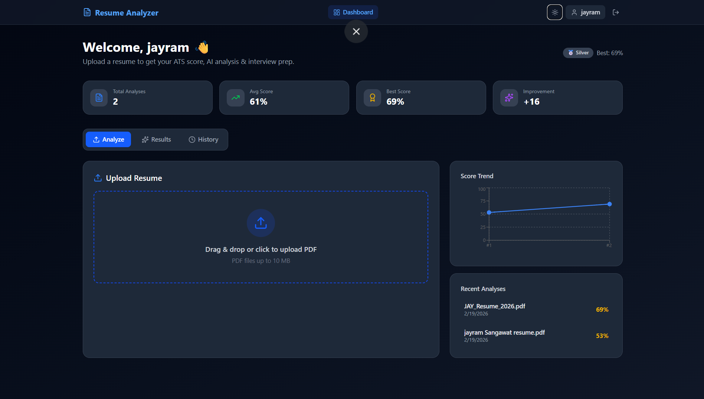
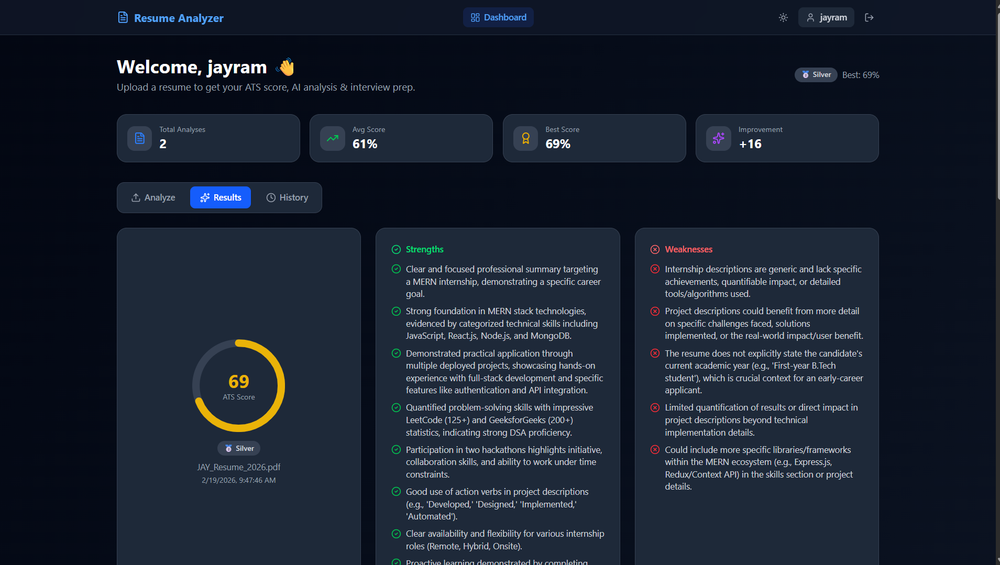
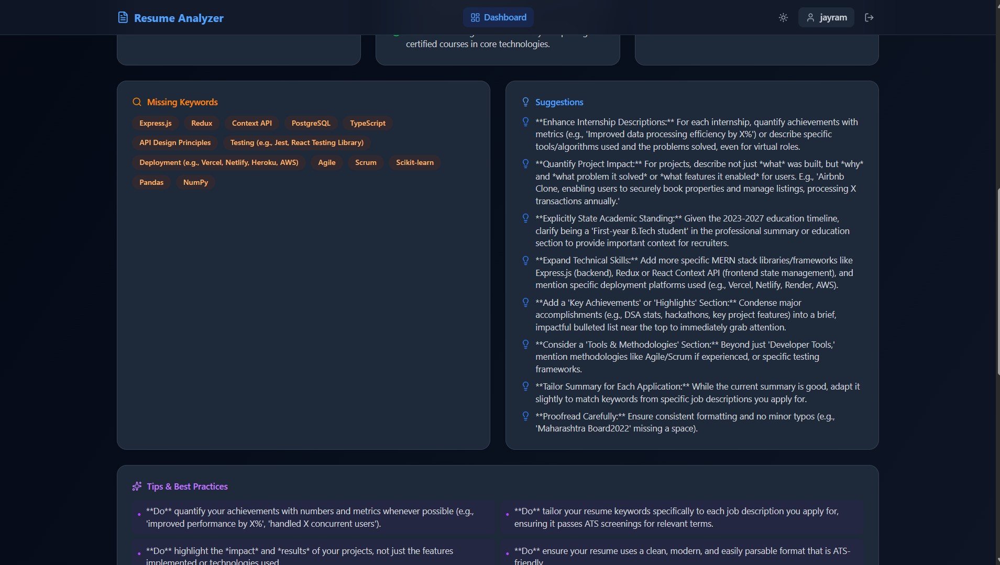
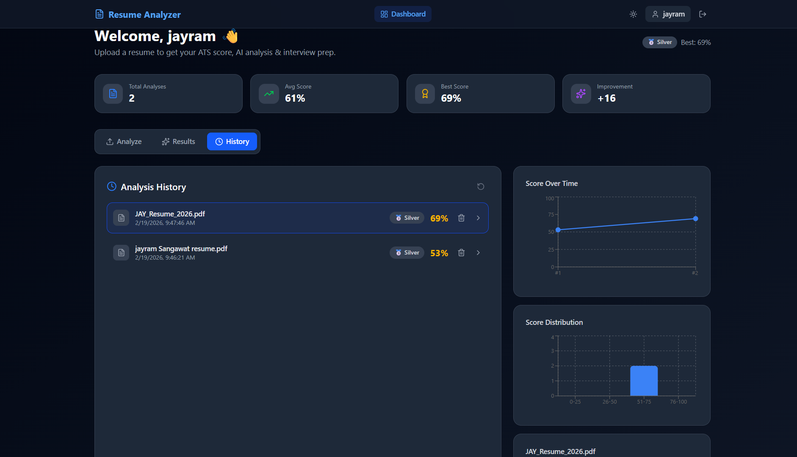
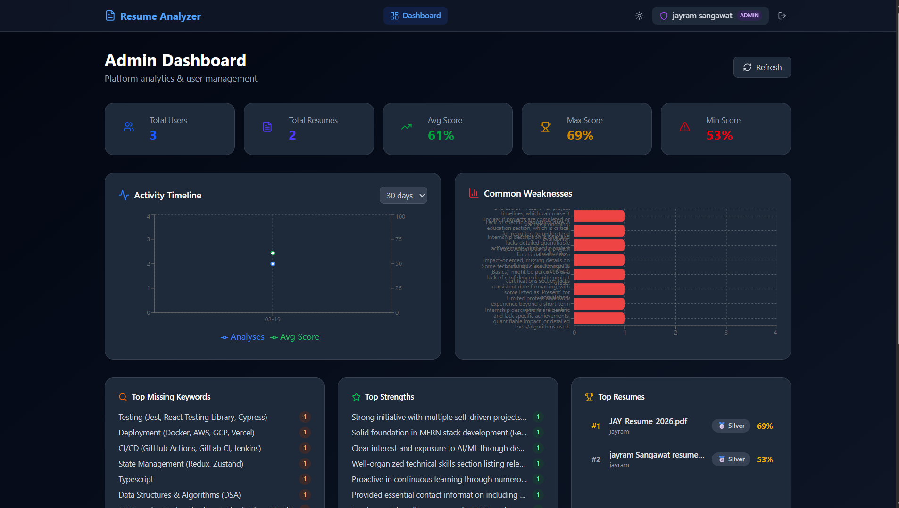
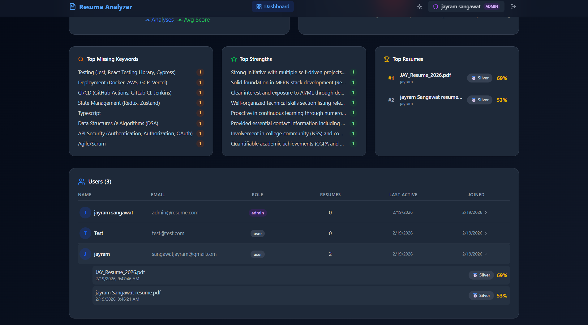

# Resume Analyzer 🚀

AI-powered resume analysis platform with ATS scoring, Gemini AI feedback, and interview prep.

## Features

- **ATS Score** — Algorithmic resume scoring (0-100)
- **AI Analysis** — Strengths, weaknesses, missing keywords, suggestions via Google Gemini
- **Interview Prep** — Auto-generated HR questions with expected answers
- **Dark/Light Mode** — Full theme support
- **Admin Dashboard** — User management, analytics, charts
- **History Tracking** — Track score improvement over time
- **Badge System** — Gold/Silver/Bronze based on scores

## Screenshots













## Tech Stack

| Layer | Tech |
|-------|------|
| Frontend | React 19, Vite 7, Tailwind CSS 4, Recharts, Lucide Icons |
| Backend | FastAPI, Python 3.9+ |
| Database | MongoDB Atlas (Motor async driver) |
| AI | Google Gemini 2.5 Flash |
| Auth | JWT + bcrypt |
| Deployment | Vercel (Serverless) |

## Getting Started

### Prerequisites
- Node.js 18+
- Python 3.9+
- MongoDB Atlas account
- Google Gemini API key

### Setup

```bash
# Clone
git clone https://github.com/jayramgit94/resume_analyzer.git
cd resume_analyzer

# Frontend
npm install

# Backend
pip install -r requirements.txt

# Environment variables
cp .env.example .env
# Edit .env with your keys
```

### Environment Variables

| Variable | Description |
|----------|-------------|
| `GEMINI_API_KEY` | Google Gemini API key |
| `MONGO_URI` | MongoDB Atlas connection string |
| `JWT_SECRET` | Random secret for JWT tokens |

### Run Locally

```bash
# Backend (terminal 1)
python main.py

# Frontend (terminal 2)
npm run dev
```

## Deployment (Vercel)

1. Push to GitHub
2. Import in [Vercel](https://vercel.com/new)
3. Set environment variables in Vercel dashboard
4. Deploy

## License

MIT
